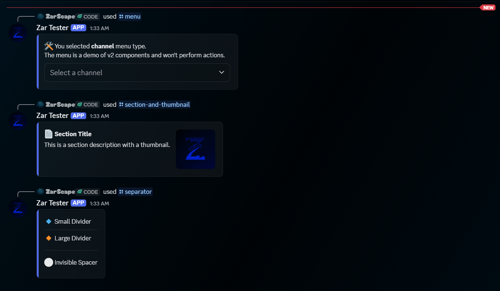
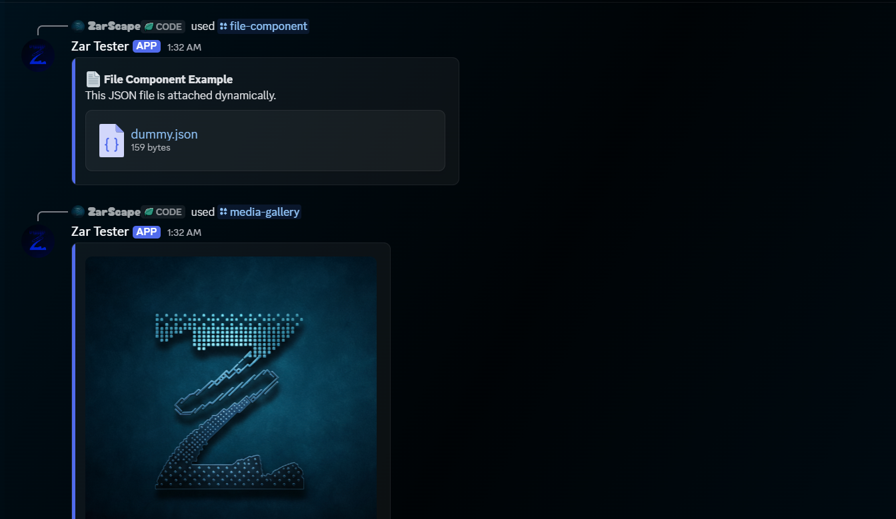
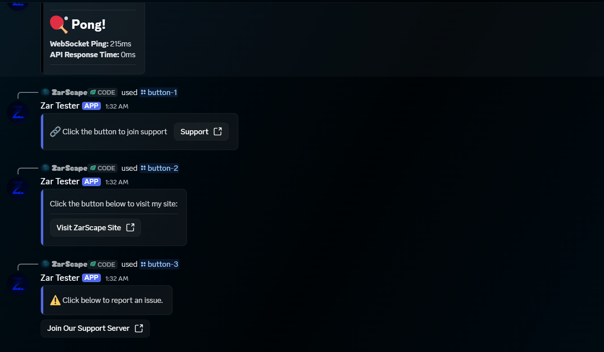
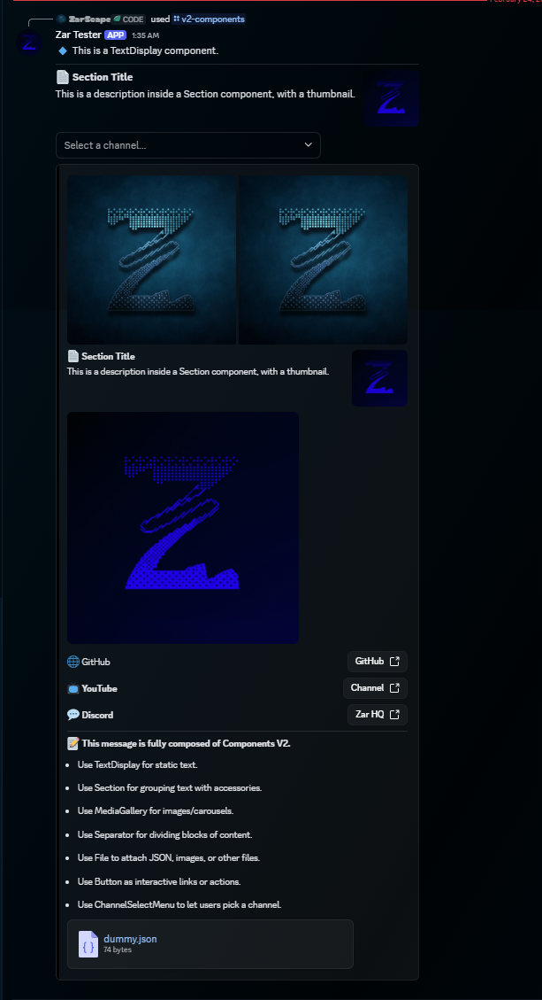
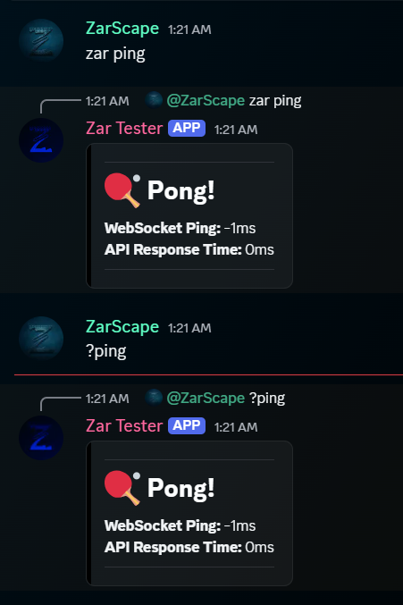

# Discord.js v14 with V2 Components Template

A full-featured Discord bot template built with **Discord.js v14** and the new **Components V2** system. This template demonstrates modern command and event handling, modular slash commands, media galleries, file components, and container-based layouts.

<p align="center">
  
</p>

# Make sure to leave a ⭐ if this helps :)
If you notice any inconsistencies or have suggestions for improvement, please report them in the Issues tab, or feel free to submit a Pull Request if you can provide a direct fix.
---

# Preview of V2 Components:

<p align="center">
<table>
  <tr>
    <td align="center">
      <br>Example 1
    </td>
    <td align="center">
      <br>Example 2
    </td>
  </tr>
  <tr>
    <td align="center">
      <br>Example 3
    </td>
  </tr>
</table>
</p>

---

<br>


<p align="center">
<table>
  <tr>
    <td align="center">
      <br>Message Command
    </td>
  </tr>
</table>
</p>


---

## 📁 Project Structure

```
📦discord.js v14 with v2 components template
┣ 📂assets                  # Project assets (e.g., images)
┣ 📂data                    # Optional data storage for bot usage
┣ 📂src
┃ ┣ 📂config
┃ ┃ ┗ 📜config.json         # Bot configuration (color, emojis, etc.)
┃ ┣ 📂console
┃ ┃ ┗ 📜watermark.js        # Optional console watermark
┃ ┣ 📂events                # Event handlers
┃ ┃ ┣ 📂client
┃ ┃ ┃ ┣ 📜interactionCreate.js   # Interaction event handler
┃ ┃ ┃ ┣ 📜messageCreate.js     # Message command handler
┃ ┃ ┃ ┗ 📜ready.js               # Ready event handler
┃ ┃ ┗ 📂Other               # Other custom events
┃ ┣ 📂handlers              # Handlers for events and commands
┃ ┃ ┣ 📜event.js               # Event loader
┃ ┃ ┣ 📜message.js             # Message command loader
┃ ┃ ┗ 📜slash.js               # Slash command loader
┃ ┣ 📂messageCommands       # Message command files organized by category
┃ ┃ ┗ 📂Info
┃ ┃   ┗ 📜ping.js
┃ ┣ 📂slashCommands         # Slash command files organized by category
┃ ┃ ┣ 📂Info
┃ ┃ ┃ ┗ 📜ping.js
┃ ┃ ┗ 📂V2 Components
┃ ┃   ┣ 📜button-1.js
┃ ┃   ┣ 📜button-2.js
┃ ┃   ┣ 📜button-3.js
┃ ┃   ┣ 📜file-components.js
┃ ┃   ┣ 📜media-gallery.js
┃ ┃   ┣ 📜menu.js
┃ ┃   ┣ 📜section.js
┃ ┃   ┣ 📜separator.js
┃ ┃   ┣ 📜text-display.js
┃ ┃   ┗ 📜v2-components.js
┃ ┣ 📂temp                 # Temporary files (e.g., generated data)
┃ ┣ 📂utils                # Utility functions
┃ ┃   ┗ 📜consoleStyle.js  # Console styling helper
┃ ┣ 📜index.js
┃ ┗ 📜zar.js
┣ 📜.env.example            # Environment variables (TOKEN, CLIENTID)
┗ 📜package.json
```

---

## ⚡ Features

- Modern **slash commands** with `SlashCommandBuilder`.
- Modern **message commands** with prefix, bot name, and mention triggers.
- Fully modular **event handler** with max listeners support.
- **V2 Components** support:
  - **TextDisplay** – display static text with Markdown.
  - **Section** – group text with thumbnails or buttons.
  - **Button** – clickable buttons (Primary, Secondary, Link, etc.).
  - **MediaGallery** – carousel of images/videos.
  - **FileBuilder / AttachmentBuilder** – send JSON or files.
  - **Separator** – divide content visually.
  - **ChannelSelectMenu** – select a channel interactively.
  - **ContainerBuilder** – aggregate multiple component types into a single layout.
- Automatic slash command registration.
- Automatic message command loading from `src/messageCommands`.
- Dummy JSON generation for testing file components.
- Modular slash commands, message commands, and events for easy scalability.
- **Sharding support** for large bots to distribute load across multiple processes.
- Console logs all loaded commands and events in a single box for clarity.

---

## ⚙ Installation

1. Clone the repository:

```bash
git clone https://github.com/ZarScape/discord.js-v14-v2-template.git
cd discord.js-v14-v2-template
````

2. Install dependencies:

```bash
npm install
```

3. Create a `.env` file in the root:

```env
TOKEN=YOUR_BOT_TOKEN
CLIENTID=YOUR_CLIENT_ID
```

4. Update `src/config/config.json` for colors, emojis, or other config values.

---

## 🚀 Running the Bot

Start the bot with:

```bash
npm start
```

You should see a consolidated console log with **all commands and events loaded**.

---

## 🧩 Adding Commands

### Slash Commands

1. Place slash command files under `src/slashCommands/[Category]/`.
2. Export `data` (`SlashCommandBuilder`) and `run`.

### Message Commands

1. Place message command files under `src/messageCommands/[Category]/`.
2. Export `name`, optional `aliases`, and `run(client, message, args, prefix)`.
3. Use any supported trigger:
   - `?ping`
   - `zar ping`
   - `@Bot ping`

### V2 Components Examples

Use files in `src/slashCommands/V2 Components/` as reference:

- `text-display.js`
- `section.js`
- `button-1.js / button-2.js / button-3.js`
- `file-components.js`
- `media-gallery.js`
- `menu.js`
- `separator.js`
- `v2-components.js` (example using all components)

---

## 📖 Guide for Components V2

* **TextDisplay** – static text messages.
* **Section** – text with accessories (Thumbnail, Buttons, Menus).
* **Button** – clickable interactive buttons.
* **MediaGallery** – carousel of images/videos.
* **FileBuilder / AttachmentBuilder** – attach JSON or images.
* **Separator** – add visual dividers or spacing.
* **ChannelSelectMenu** – interactive channel selection.
* **ContainerBuilder** – wraps multiple components into a single structured layout.

All of these components are included in separate commands as examples.

---

## 🔧 Customization

* Change **accent colors** in `src/config/config.json` (`color`).
* Configure message command triggers in `src/config/config.json`:
  - `prefix` for prefix commands (example: `?`)
  - `botName` for name-based commands (example: `zar`)
* Replace **images** in `src/assets/` and update paths in commands.
* Add your own slash commands in `src/slashCommands/` and message commands in `src/messageCommands/`.
* Add your own **buttons, menus, or media galleries** to create unique interactions.

---

## 📂 Folder Usage

* `src/assets` – local images, dummy JSONs, or other media.
* `src/temp` – for temporary files generated by commands.
* `src/utils` – helper functions for reuse.
* `src/handlers` – loaders for events, slash commands, and message commands.
* `src/events/client` – core client events including `interactionCreate` and `messageCreate`.
* `src/slashCommands` – slash command files organized by category.
* `src/messageCommands` – message command files organized by category.

---

## 📝 Notes

* Ensure `MessageFlags.IsComponentsV2` is set when sending V2 components.
* Slash commands are automatically registered at app start.
* Message commands are automatically loaded at app start.
* Message commands can be triggered using `prefix`, `botName`, or bot mention.
* Ensure `prefix` and `botName` are set in `src/config/config.json` for message command routing.
* All console output for commands/events is consolidated in one box for readability.

---

## ⚖ License

ISC License – free to use and modify for personal or commercial projects.

---

## Runtime Notes

* Console styling now uses Node's native `util.styleText`
* The startup logging helper lives in `src/utils/consoleStyle.js`.

---

## Changelog

Recent updates are tracked in:

- [CHANGELOG.md](CHANGELOG.md)

---

## 📞 Support

Join the [Zar HQ Discord](https://discord.gg/6YVmxA4Qsf) for help, updates, and discussion.